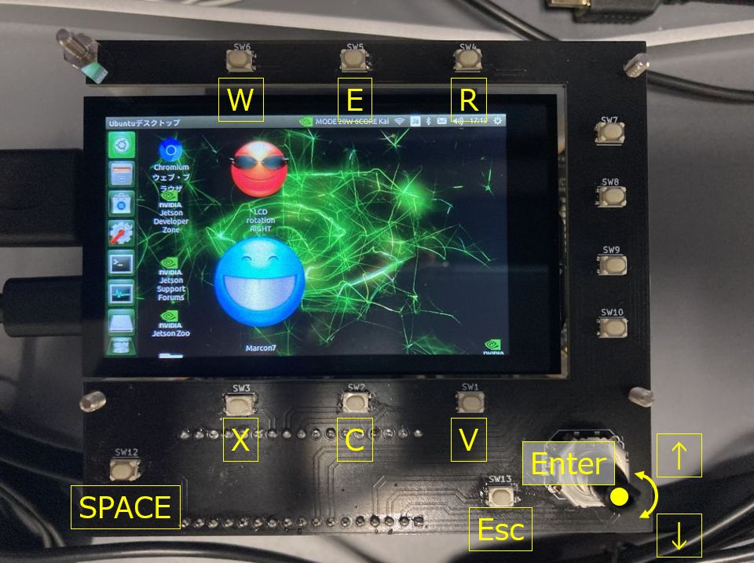
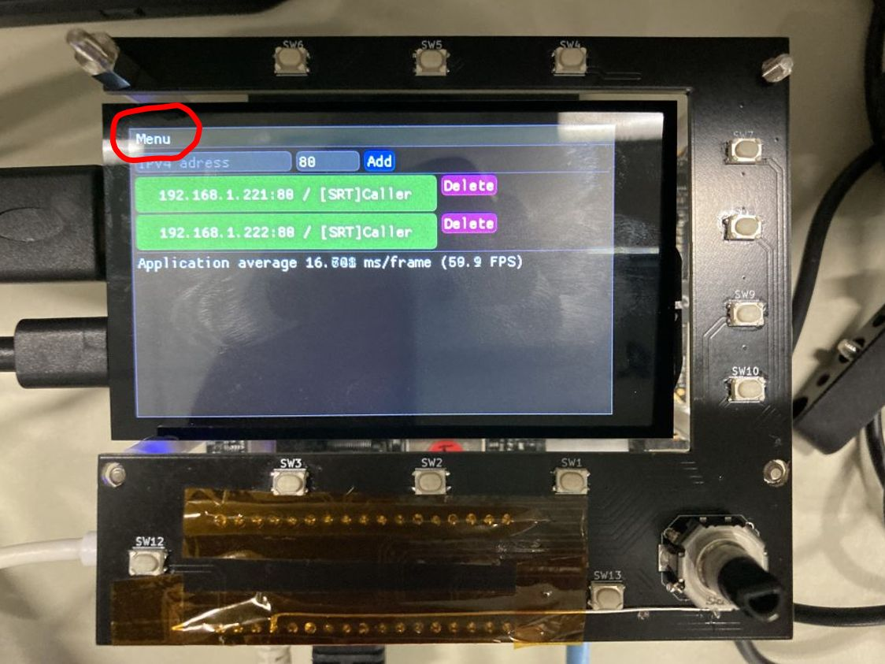

# Marcon
ILME-FR7 用のリモコンツール(via IP ネットワーク)。

## ソース一式の取得(git clone)
```bash
git clone --recursive https://github.com/HiroshiYAMA/Marcon
又は、
git clone --recursive git@github.com:HiroshiYAMA/Marcon.git
```

もし、submodule を取得し忘れていたら、
```bash
git submodule update --init --recursive
```

## 必要なもの
* OpenSSL ver.3
  * 結構なシステムにインストールされているであろう OpenSSL ver.1 系の
ダイナミックリンクライブラリとの不意な競合を避けるには
スタティックリンクライブラリとしてビルドすると良い。

```bash
./Configure --prefix=/opt/openssl3 --openssldir=/usr/local/ssl3 zlib no-shared
make -j$(nproc)
make test
sudo make install
```

## ビルド & インストール
```bash
mkdir -p build
cd build
cmake -DCMAKE_BUILD_TYPE=Release ..
make install

# install ディレクトリ内に実行ファイル marcon が出来る。
```

## 実行
```bash
# install ディレクトリにて、 
./marcon
```

## キーバインド

こんな感じのボタンパネル。




### 共通
| key | description |
| --- | --- |
| Enter | go to Live View |
| ESC | back to previous |
| Shift + Q | exit Application |

### Camera Main パネル
| key | description |
| --- | --- |
| W | go to FPS panel |
| E | go to ISO panel |
| R | go to Shutter panel |
| X | go to ND panel |
| C | go to IRIS panel |
| V | go to White Balance panel |
| Space | Click **REC** button |

### Camera Control パネル
| key | description |
| --- | --- |
| E, cursor UP | select item above |
| V, curos DOWN | select item below |
| X | go to MODE select panel |
| W | go to MODE(another) select panel |

## マウス/タッチ操作
### 押せそうなボタンっぽい箇所
押すとおおよそ期待どおりの動作をする。

### ESC キーの代わり
右から左に画面いっぱいにドラッグすると ESC キーと同じ挙動をする。  
**Left <-- Right**

### (Camera Control パネル) X キーの代わり
左から右に画面いっぱいにドラッグすると X キーと同じ挙動をする。  
(go to MODE select panel)  
**Left --/ Right**

ただし、
W キーが有効な時(MODE(another)がある時)は、
斜めに左下から右上に画面いっぱいにドラッグすると X キーと同じ挙動をする。  

### (Camera Control パネル) W キーの代わり
斜めに左上から右下に画面いっぱいにドラッグすると W キーと同じ挙動をする。  
(go to MODE(another) select panel)  
**Left --\\ Right**

### (Launcher パネル) アプリケーションの終了
ぐちゃぐちゃぐちゃ～っとマウスをドラッグするかタッチパネルをこすると
アプリケーションを終了する。
左右に 5 往復くらいかな。

## Ubuntu のディスプレイ表示の回転
時々、ディスプレイ表示が縦長なのがある。
それを横長にするには、
[ここの Web サイト](http://bluearth.cocolog-nifty.com/blog/2019/12/post-e5f4f1.html)
を参考すると良い。

右回転のスクリプトはこれ。
適宜、LCDのデバイス名(例、***WaveShare WS170120***)は変更してね。
```bash
#!/bin/bash

SLEEP_SEC=${1:-0}

sleep ${SLEEP_SEC}

export DISPLAY=:0.0

# display rotation.
xrandr --output HDMI-0 --rotate right

# pointing device rotation.
LCD_ID=$(xinput | grep 'WaveShare WS170120' | perl -pe 's/^.*\Wid=([0-9]+)\W.*$/${1}/')
xinput set-prop ${LCD_ID} 'Coordinate Transformation Matrix' 0 1 0 -1 0 1 0 0 1
```

## GUI のスキン変更
起動直後の表示パネルの最上部左寄りに **"Menu"** があるので、
そこの **"Change skin"** から適宜選択する。



## テストプログラムたち
test ディレクトリ以下に置いてある。
* [cgi_test](./test/cgi_test/)
* [cgi_test_cpprestsdk](./test/cgi_test_cpprestsdk/)
* [cgi_test_cpr](./test/cgi_test_cpr/)
* [srt_receive](./test/srt_receive/)
